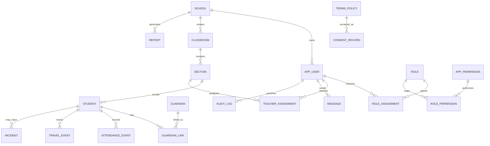
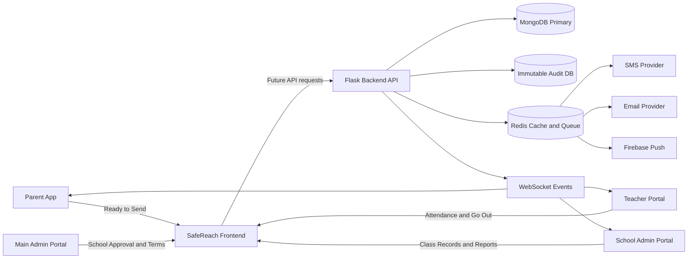
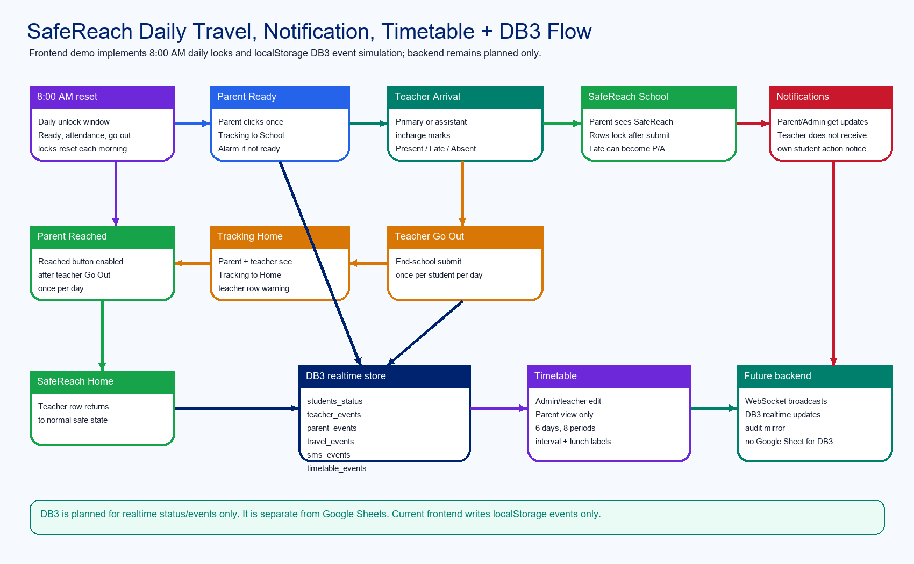
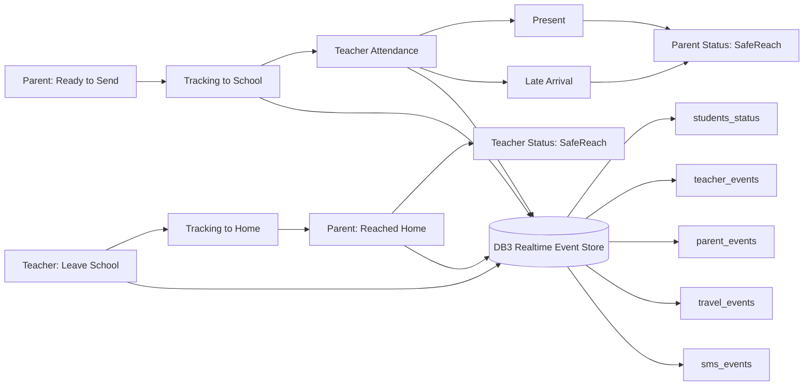
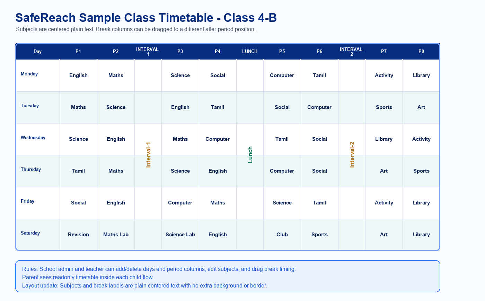
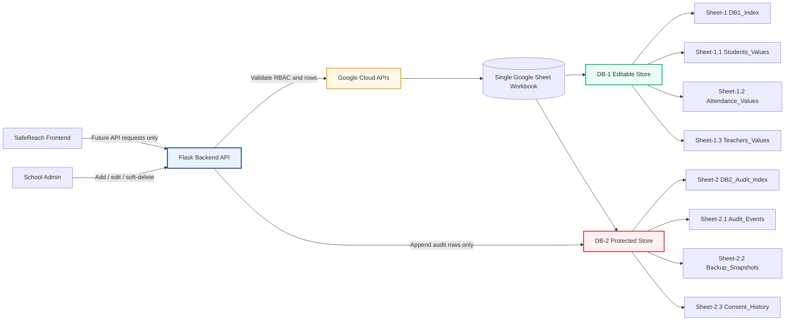

<div align="center">

  

  <p>
    <strong>SafeReach</strong> is a school safety and student management platform for main admins, school admins, teachers, and parents.
    This repository currently contains a working frontend demo plus professional backend planning documents.
  </p>

  <p>
    
    
    
    
    
  </p>

  <p>
    <a href="#quick-start">Quick Start</a>
    <span> | </span>
    <a href="#frontend-details">Frontend</a>
    <span> | </span>
    <a href="#backend-blueprint">Backend</a>
    <span> | </span>
    <a href="#database-plan">Database</a>
    <span> | </span>
    <a href="#er-diagram">ER Diagram</a>
    <span> | </span>
    <a href="#data-flow">Data Flow</a>
    <span> | </span>
    <a href="#google-sheets-db-plan">Google Sheets DB</a>
    <span> | </span>
    <a href="#visual-style">Visual Style</a>
  </p>

</div>

---

## Overview

SafeReach is designed for real-world school safety operations:

- Main admin monitors all schools and approves school onboarding.
- School admin manages class records, staff, messages, incidents, and reports.
- Teacher manages assigned class students, attendance, SMS status updates, and class messages.
- Parent monitors children, attendance, travel status, messages, and reports.

The current codebase is frontend-only. Backend, database, SMS, WebSocket, and production authentication are planned but not created yet.

## Quick Start

```powershell
cd E:\Projects\Live\SafeReach\frontend
npm install
npm run dev
```

Open:

```text
http://localhost:3000
```

Production build:

```powershell
cd E:\Projects\Live\SafeReach\frontend
npm run build
npm start
```

## Project Structure

```text
SafeReach/
  frontend/
    app/
      admin/
      teacher/
      parent/
      main-admin/
      login/
      school-registration/
    components/
    lib/
    scripts/
    README.md
  doc/
    frontend/
    backend/
  README.md
```

## Frontend Details

| Area | Details |
| --- | --- |
| Framework | Next.js App Router |
| UI | React, TypeScript, Tailwind CSS |
| State | Frontend demo state with localStorage |
| Routing | Role-based pages for admin, teacher, parent, and main admin |
| Landing | Animated SafeReach hero, travel map, role previews, and backend-ready section |
| Current mode | Frontend-only demo |

Important routes:

| Route | Purpose |
| --- | --- |
| `/` | Animated landing page |
| `/login` | Normal role login selection |
| `/school-registration` | School admin registration request |
| `/admin/dashboard` | School admin overview |
| `/admin/students` | Class Records |
| `/admin/students/class-view` | Class teacher and class student containers |
| `/admin/messages` | Admin common group, teacher direct, parent direct messages |
| `/admin/teachers` | Staff management and incharge assignment |
| `/teacher/attendance` | Attendance, SMS status, go-out attendance |
| `/parent/dashboard` | Parent child travel status |
| `/main-admin/dashboard` | Platform main admin dashboard |

## Backend Blueprint

Recommended future backend stack:

| Layer | Recommendation |
| --- | --- |
| API | Python Flask |
| App Server | Gunicorn |
| Primary DB | MongoDB |
| Audit DB | Separate append-only MongoDB audit/backup store |
| Cache / Queue | Redis |
| Realtime | WebSocket or Socket.IO |
| Notifications | SMS, email, Firebase push |
| Deployment | Render first, Kubernetes later |
| Monitoring | Prometheus, Grafana, ELK |
| CI/CD | GitHub Actions |

Planned backend modules:

- Authentication and JWT sessions
- Refresh tokens
- Password hashing
- RBAC permission control
- School management
- User, teacher, parent, student management
- Class and section management
- Attendance and leave events
- Student travel lifecycle
- Emergency alerts
- SMS, email, push notifications
- Reports and analytics
- Audit logs
- Terms and consent records
- Health checks and metrics

## Database Plan

Primary MongoDB collections:

```text
schools
users
roles
permissions
classes
sections
students
guardians
teacher_assignments
attendance_events
travel_events
messages
incidents
reports
notifications
terms_policies
consent_records
audit_logs
```

Audit database rule:

- Append-only audit writes
- Restricted credentials
- No normal application delete path
- WORM-style retention policy where supported
- Separate backup and recovery process

## ER Diagram

The ER diagram below avoids reserved Mermaid entity names. For example, `CLASSROOM` is used instead of `CLASS`.



## Data Flow



## DB3 Realtime Travel Logic

SafeReach plans a separate `DB3` realtime event store for live status and event updates. This is not Google Sheets storage and is not implemented as backend code yet. In the current frontend demo, the same idea is represented with localStorage event records.





Frontend demo behavior:

- Parent clicks `Ready to Send`; parent and teacher see `Tracking to School`.
- Parent can enable an alarm reminder if they may forget to click `Ready to Send`.
- `Ready to Send` is enabled once per child after the daily 8:00 AM reset.
- Teacher clicks `Present`; teacher sees `Present`, parent sees `SafeReach`.
- Teacher clicks `Late`; the same late attendance logic remains available.
- Teacher attendance marking is available to the primary incharge and assistant incharge.
- Teacher submits go-out attendance; parent and teacher see `Tracking to Home`.
- Teacher go-out attendance is enabled once per student per day after the daily 8:00 AM reset.
- Parent `Reached Home` is enabled only after teacher go-out submission and can be clicked once per day.
- Parent clicks `Reached Home`; teacher sees `SafeReach` and the warning row returns to normal.
- Teacher rows use different background colors while a student is still tracking or not safely reached.
- Parent/admin notification pages receive student status updates; the teacher does not receive their own student-action notification.

Future backend DB3 tables:

| DB3 Table | Purpose |
| --- | --- |
| `students_status` | Latest realtime student travel and safety state |
| `teacher_events` | Teacher attendance, late, present, absent, and go-out actions |
| `parent_events` | Parent ready-to-send, alarm, and reached-home confirmations |
| `travel_events` | Movement lifecycle events between home and school |
| `sms_events` | Generated SMS notification records and delivery status |
| `timetable_events` | Timetable day, period, subject, interval, and lunch changes |

## Timetable Plan

SafeReach includes a frontend-only timetable module for school admin, teacher, and parent roles. Subjects display as plain centered table text with no extra subject background or border. Interval and lunch display as merged narrow vertical columns between class periods, so each break label appears once across all day rows instead of repeating in every row.



| Role | Timetable Access |
| --- | --- |
| School Admin | Add, edit, delete timetable days, period columns, subjects, intervals, and lunch labels |
| Teacher | Add, edit, delete timetable entries for assigned class/section demo flow |
| Parent | View-only timetable from each child container |

Default timetable behavior:

- 6 days by default: Monday through Saturday.
- 8 periods per day by default.
- `Interval-1` is a merged vertical column after period 2.
- `Lunch` is a merged vertical column after period 4.
- `Interval-2` is a merged vertical column after period 6.
- Break labels display as plain vertical text inside the table cell, without an extra label background or border.
- Admin/teacher can drag `Interval-1`, `Lunch`, or `Interval-2` into an after-period slot to change the timing position.
- Admin/teacher can add or remove days and period columns.
- Admin/teacher can edit the interval and lunch labels, and the frontend keeps them in the same column positions.
- Parent can only view the current child standard timetable.

## Google Sheets DB Plan

SafeReach can optionally connect a single Google Sheet workbook through Google Cloud APIs for spreadsheet-backed storage or mirroring. This is a future backend plan only.



| Sheet Area | Example Tabs | Rule |
| --- | --- | --- |
| `DB-1` editable store | `Sheet-1`, `Sheet-1.1`, `Sheet-1.2` | Add, edit, read, and controlled soft-delete allowed through backend validation |
| `DB-1` schema/index | `Sheet-1 DB1_Index` | Stores table keys, tab names, attributes, primary keys, and allowed actions |
| `DB-2` protected store | `Sheet-2`, `Sheet-2.1`, `Sheet-2.2` | Append-only audit/backup store; no normal update/delete path |
| `DB-2` schema/index | `Sheet-2 DB2_Audit_Index` | Stores protected audit tab names, retention rules, and append sources |

Important rules:

- Frontend must not write directly to Google Sheets.
- Backend should use Google Cloud service credentials stored only in environment variables or secret manager.
- `DB-1` can support add, edit, read, and controlled soft-delete.
- `DB-2` should expose append-only audit and backup functions.
- MongoDB remains the recommended primary database for production-scale deployments.

## Permission Model

Example permission keys:

```text
app.main_admin.school.approve
app.main_admin.terms.edit
app.admin.class.create
app.admin.teacher.add
app.admin.teacher.assign_incharge
app.admin.teacher.assign_assistant_incharge
app.admin.student.open
app.admin.student.edit
app.admin.student.archive
app.admin.message.teacher.direct
app.teacher.attendance.mark
app.teacher.student.manage
app.parent.child.status.read
```

Assistant incharge should receive the same class-section permissions as the primary incharge, limited to assigned classes and sections.

## Visual Style

SafeReach uses a safety-technology palette:

| Role | Color |
| --- | --- |
| Primary navy | `#00236f` |
| Deep background | `#06142b` |
| Safety teal | `#00a77f` |
| Live cyan | `#22d3ee` |
| Success green | `#22c55e` |
| Alert red | `#c9182b` |
| Soft surface | `#eef8f6` |

## Animation Style

- Floating 3D travel map
- Glowing route lines
- Pulsing student status pins
- Animated dashboard cards
- Mobile parent alert pulse
- Smooth hover lift on cards and buttons
- Reduced motion support should be added for production accessibility

Example:

```css
.safe-card {
  transition: transform 180ms ease, box-shadow 180ms ease, border-color 180ms ease;
}

.safe-card:hover {
  transform: translateY(-3px);
  box-shadow: 0 18px 40px rgba(15, 23, 42, 0.14);
}

.live-alert {
  animation: safePulse 1.5s ease-in-out infinite;
}

@keyframes safePulse {
  0%, 100% {
    opacity: 1;
    transform: scale(1);
  }
  50% {
    opacity: 0.72;
    transform: scale(1.03);
  }
}
```

## Development Notes

- Do not commit secrets.
- Do not create backend code inside `frontend/`.
- Keep frontend demo data clearly separated from future backend APIs.
- Run `npm run build` before deployment.
- Use incognito mode with extensions disabled when debugging browser-extension console messages.

## Deployment Plan

Frontend:

```text
Platform: Vercel or GitHub Pages static export workflow
Root Directory: frontend
Install Command: npm install
Build Command: npm run build
```

Backend later:

```text
Platform: Render first
Runtime: Python Flask + Gunicorn
Database: MongoDB
Cache/Queue: Redis
Future Scale: Kubernetes
```

---

<div align="center">
  <strong>SafeReach</strong><br />
  Smart safety workflows for modern school operations.
</div>
