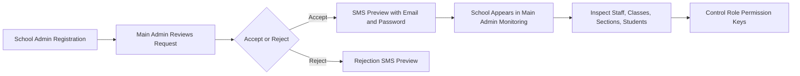

<div align="center">

  

  <p>
    <strong>SafeReach</strong> is a colorful Next.js frontend prototype for school safety, student monitoring, school administration, parent visibility, teacher workflows, and app-level main-admin control.
  </p>

  <p>
    
    
    
    
  </p>

  <p>
    
    
    
    
  </p>

  <p>
    <a href="#quick-start">Quick Start</a>
    <span> | </span>
    <a href="#demo-login-credentials">Demo Logins</a>
    <span> | </span>
    <a href="#route-map">Routes</a>
    <span> | </span>
    <a href="#feature-highlights">Features</a>
    <span> | </span>
    <a href="#project-structure">Structure</a>
  </p>

</div>

---

## Overview

SafeReach is currently a **frontend-only demo application**. It is built for planning and validating screens before a future backend is added.

<table>
  <tr>
    <td><strong>App Name</strong></td>
    <td>SafeReach</td>
  </tr>
  <tr>
    <td><strong>Frontend Framework</strong></td>
    <td>Next.js App Router</td>
  </tr>
  <tr>
    <td><strong>User Roles</strong></td>
    <td>Main Admin, School Admin, Teacher, Parent</td>
  </tr>
  <tr>
    <td><strong>Backend Status</strong></td>
    <td>No backend, database, API, Docker backend, or backend connection has been created.</td>
  </tr>
  <tr>
    <td><strong>Data Status</strong></td>
    <td>Demo/static/local frontend state only.</td>
  </tr>
</table>

---

## Quick Start

> Run all frontend pages, including the normal portals and the separate main-admin area, from the same `frontend` folder.

```powershell
cd frontend
npm install
npm run dev
```

Open:

```text
http://localhost:3000
```

Production flow:

```powershell
npm run build
npm start
```

---

## Demo Login Credentials

### Main Admin

> Main Admin is intentionally separate from the normal role-selection page.

| Field | Value |
|---|---|
| URL | `/main-admin/login` |
| Email | `mainadmin@safereach.app` |
| Password | `MainAdmin@2025` |
| OTP Code | `123456` |

### School Admin

| Field | Value |
|---|---|
| URL | `/login/admin` |
| Email | `admin@demo.safereach.edu` |
| Password | `Admin@2025` |
| OTP Code | `000000` |

### Teacher

| Field | Value |
|---|---|
| URL | `/login/teacher` |
| Email | `teacher@demo.safereach.edu` |
| Password | `Teacher@2025` |

### Parent

| Field | Value |
|---|---|
| URL | `/login/parent` |
| Email | `parent@demo.safereach.edu` |
| Password | `Parent@2025` |

---

## Feature Highlights

<table>
  <tr>
    <th>Area</th>
    <th>Highlights</th>
  </tr>
  <tr>
    <td><strong>Main Admin</strong></td>
    <td>Separate owner login, school request approval, SMS preview, school monitoring, staff view, class-section-student drilldown, permission toggles, and app-wide reports.</td>
  </tr>
  <tr>
    <td><strong>School Admin</strong></td>
    <td>Dashboard, student grouping by class and section, student promotion to next standard, teacher creation, class-section incharge assignment, incidents, reports, account actions, support, and profile pages.</td>
  </tr>
  <tr>
    <td><strong>Teacher</strong></td>
    <td>Assigned-class student add/edit/remove, attendance, reports, safety protocols, messages, support, settings, and profile pages.</td>
  </tr>
  <tr>
    <td><strong>Parent</strong></td>
    <td>Child dashboard, attendance range/month filters, marks report filters, messages, child records, safety protocols, support, settings, and profile pages.</td>
  </tr>
  <tr>
    <td><strong>Responsive UI</strong></td>
    <td>Fixed top headers, mobile menu buttons, horizontal table scrolling, and frontend-only download/export actions.</td>
  </tr>
</table>

---

## Route Map

### Public and Auth

| Route | Description |
|---|---|
| `/` | Normal role selection for School Admin, Teacher, and Parent |
| `/login/admin` | School admin login with OTP |
| `/login/teacher` | Teacher login |
| `/login/parent` | Parent login |
| `/login/forgot-password` | Forgot password flow |
| `/school-registration` | School admin request form for creating a school environment |
| `/main-admin/login` | Separate app-owner main admin login |

### Main Admin Portal

| Route | Description |
|---|---|
| `/main-admin/dashboard` | App-level control center for school requests, schools, users, permissions, classes, sections, and students |
| `/main-admin/reports` | App-wide monitoring reports, school health, role audit, and CSV export |

### School Admin Portal

| Route | Description |
|---|---|
| `/admin/dashboard` | System overview and safety report drilldown |
| `/admin/students` | Class and section based student records |
| `/admin/students/add` | Student enrollment form |
| `/admin/students/profile` | Student profile and safety details |
| `/admin/teachers` | Teacher management and class-section incharge assignment |
| `/admin/teachers/profile` | Teacher profile |
| `/admin/incidents` | Incident log with priority order and accept/reject actions |
| `/admin/reports` | Safety reports and exports |
| `/admin/account` | Admin account action hub |
| `/admin/access` | User access settings |
| `/admin/security` | Security settings |
| `/admin/audit` | System audit |
| `/admin/preferences` | System preferences |
| `/admin/profile` | Admin profile |
| `/admin/support` | Support page |

### Teacher Portal

| Route | Description |
|---|---|
| `/teacher/dashboard` | Class dashboard and safety protocol area |
| `/teacher/students` | Assigned-class student add/edit/remove |
| `/teacher/attendance` | Attendance management |
| `/teacher/messages` | Parent and staff messages |
| `/teacher/reports` | Incident and class reports |
| `/teacher/settings` | Teacher settings |
| `/teacher/profile` | Teacher profile |
| `/teacher/support` | Support page |

### Parent Portal

| Route | Description |
|---|---|
| `/parent/dashboard` | Child safety dashboard |
| `/parent/students` | My children |
| `/parent/children/records` | Child records quick-access page |
| `/parent/attendance` | Attendance history with date/month/year filters |
| `/parent/messages` | Messages |
| `/parent/reports` | Marks and subject performance report filters |
| `/parent/settings` | Parent settings |
| `/parent/profile` | Parent profile |
| `/parent/support` | Support page |

---

## Main Admin Workflow



> If your Markdown viewer does not support Mermaid, the same workflow is still represented by the route and feature tables above.

---

## Permission Key Examples

| Permission Key | Role | Meaning |
|---|---|---|
| `app.main.school.accept` | Main Admin | Approve a school environment request |
| `app.main.school.reject` | Main Admin | Reject a school environment request |
| `app.main.user.monitor` | Main Admin | Monitor all schools, roles, and users |
| `app.admin.student.add` | School Admin | Add student records |
| `app.admin.student.edit` | School Admin | Edit student records |
| `app.admin.student.delete` | School Admin | Delete student records when enabled |
| `app.admin.class.assign` | School Admin | Assign class-section incharge teacher |
| `app.teacher.student.add` | Teacher | Add students in assigned class |
| `app.teacher.student.edit` | Teacher | Edit students in assigned class |
| `app.teacher.student.delete` | Teacher | Remove students in assigned class when enabled |

---

## Tech Stack

| Layer | Technology |
|---|---|
| Framework | Next.js 15 App Router |
| UI Library | React 19 |
| Language | TypeScript 5 |
| Styling | Tailwind CSS 3 |
| Icons | Material Symbols Outlined |
| Runtime | Node.js |
| Data | Static arrays, component state, and localStorage demo data |

---

## Project Structure

```text
frontend/
|-- app/
|   |-- page.tsx
|   |-- login/
|   |-- main-admin/
|   |   |-- login/
|   |   |-- dashboard/
|   |   `-- reports/
|   |-- school-registration/
|   |-- admin/
|   |-- teacher/
|   `-- parent/
|-- components/
|   |-- AdminSidebar.tsx
|   |-- AdminTopNav.tsx
|   |-- MainAdminShell.tsx
|   |-- ParentSidebar.tsx
|   |-- TeacherSidebar.tsx
|   `-- LogoutConfirmButton.tsx
|-- lib/
|   `-- downloadFile.ts
|-- scripts/
|   `-- run-next.cjs
|-- tailwind.config.ts
|-- next.config.ts
|-- tsconfig.json
|-- package.json
`-- README.md
```

---

## Design System

### Brand Tokens

| Token | Hex | Usage |
|---|---|---|
| `primary` | `#00236f` | Main brand, headings, buttons |
| `secondary` | `#006b5f` | Success states and secondary actions |
| `tertiary` | `#4b1c00` | Accent surfaces |
| `error` | `#ba1a1a` | Alerts, critical states, delete actions |
| `background` | `#f8f9fb` | App background |
| `surface` | `#f8f9fb` | Cards and panels |

### UI Behavior

| Pattern | Status |
|---|---|
| Fixed top headers | Added for admin, parent, and teacher shells |
| Mobile side navigation | Three-line menu opens and closes the side menu |
| Horizontal table scroll | Added where tables can exceed viewport width |
| Logout confirmation | Logout asks for confirmation before returning to role selection |
| Download/export | Frontend CSV/text download helpers |
| Backend connections | Not created |

---

## Available Scripts

| Script | Description |
|---|---|
| `npm run dev` | Start development server |
| `npm run build` | Build production app |
| `npm start` | Start production server |
| `npm run lint` | Run lint command through the Next helper |

---

## Important Notes

> This is a prototype. Do not treat the demo login values or local frontend state as production authentication or production data storage.

- Authentication is simulated.
- Main-admin approval and SMS behavior is frontend preview only.
- School requests are stored locally in browser localStorage for the demo.
- No backend folder, backend API, database, Docker backend, or Kubernetes manifests are created by this frontend.
- Future backend work should replace duplicate static arrays with real school, class, section, student, staff, permission, and audit APIs.

---

<div align="center">

  

</div>
